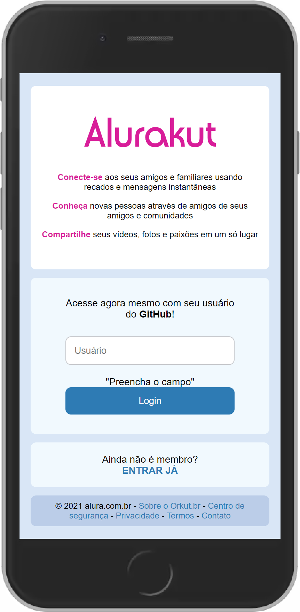
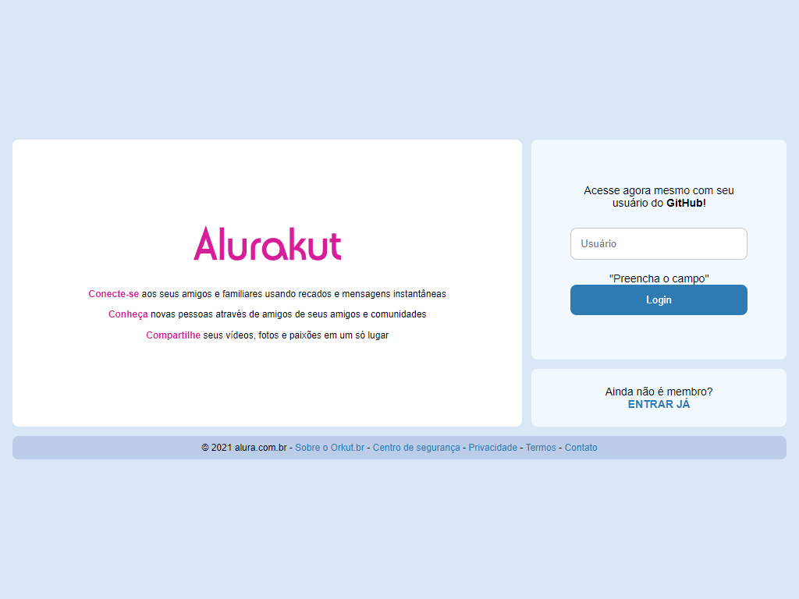

# Alurakut - Remember him?

Alurakut é um remolde do Orkut, antiga rede social, com os padrões de desenvolvimento e estilização atuais. Construído com:

- ReactJS,
- Next.js e
- styled-components.

Os requests são feitos tanto através da FetchAPI — requests de dados de usuários do Github — quanto pelo GraphQL — requests para o DatoCMS, um Headless CMS, via APIs.

[Entre no site e logue você também com sua conta do Github.](https://alurakut-git-main-eduardoreisux.vercel.app/ "Link para o site")

---

Por fim, obrigado aos organizadores: omariosouto, juunegreiros e peas pela oportunidades de aprendizados.
